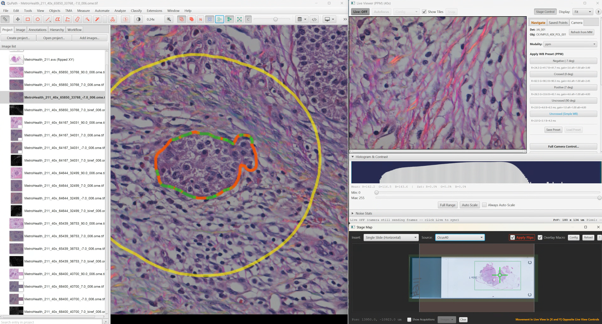

# QuPath Dialog Position Manager

A QuPath extension that remembers and restores dialog window positions across sessions, with automatic recovery for windows that become inaccessible (e.g., when a monitor is disconnected).



## Features

- **Automatic position persistence**: Dialog positions and sizes are saved when closed and restored when reopened
- **Off-screen recovery**: Automatically detects and recovers dialogs positioned on disconnected monitors
- **HiDPI awareness**: Handles display scaling changes and mixed-DPI multi-monitor setups
- **Track all dialogs by default**: Works out-of-the-box with any QuPath dialog
- **Shared storage (0.4.0+)**: Point multiple workstations at one JSON file on a network drive to share dialog layouts across a core facility

## Installation

1. Download the latest JAR from the releases
2. Drag and drop onto QuPath, or copy to your QuPath extensions folder

## Where to Find the Settings

All Dialog Position Manager controls are located in the **Window** menu:

| Menu Item | Description |
|-----------|-------------|
| **Window > Dialog Position Manager...** | Opens the full management UI |
| **Window > Recover Off-Screen Dialogs** | Quick action to recover all lost dialogs |

## Recovering a Lost Dialog

If a dialog window has moved off-screen or become inaccessible:

### Quick Recovery (All Dialogs)

1. Go to **Window > Recover Off-Screen Dialogs**
2. All off-screen dialogs will be instantly centered on your primary monitor

### Manual Recovery (Specific Dialog)

1. Go to **Window > Dialog Position Manager...**
2. Find the dialog in the list (off-screen dialogs are marked with `[OFF-SCREEN]` in orange)
3. Select it and click **Center** to move it to your primary screen

### Resetting to Default Position

If a dialog keeps appearing in an unwanted location:

1. Go to **Window > Dialog Position Manager...**
2. Find the dialog in the list
3. Click **Reset Position** to clear its saved position
4. The next time the dialog opens, QuPath will use its default positioning

### Nuclear Option

To clear ALL saved dialog positions and start fresh:

1. Go to **Window > Dialog Position Manager...**
2. Click **Clear All** (bottom right, in red)

## Known Limitations

The extension works well with most QuPath dialogs, but there are some cases where position restoration may not work:

### Modal Dialogs

Dialogs that block the UI (like Cell Detection, other analysis dialogs) have strict timing requirements. Position restoration usually works, but occasionally QuPath may override the position. If this happens, manually reposition the dialog and it should be remembered next time.

### Dialogs with Dynamic Titles

Dialogs whose titles change based on context (e.g., titles that include the current image name or file path) won't be recognized between sessions because the title is used as the identifier. Each unique title is treated as a separate dialog.

### Dialogs That Force Centering

Some dialogs are programmed to center themselves on their parent window every time they open. The extension attempts to override this by re-applying the saved position after the dialog shows, but some dialogs may resist.

### First-Time Dialogs

A dialog must be opened, positioned, and closed at least once before its position will be remembered. The first time you open any dialog, it will appear in QuPath's default location.

## Issues

### Silent prune of saved positions (Fixed in v0.4.0)

On installations with many tracked dialogs, the v0.3.x code would silently
prune the oldest entries from saved positions on every save once the
serialized JSON exceeded ~7500 characters. The visible symptom was a
specific dialog (often Live Viewer in QPSC) appearing centered every time
it opened, no matter how many times you reset and re-saved its position. The
log showed:

```
WARN  DialogPositionPreferences  Dialog positions JSON too large (7548 chars), pruning entries
```

**Fix:** Update to 0.4.0+. Storage moved out of the size-capped Java
Preferences entry into a JSON file with no practical size limit. On first
launch after the upgrade, existing data is migrated and a one-time dialog
shows the new file location.

### "Value too long" Error (Fixed in v0.2.0)

In versions prior to 0.2.0, the extension could accumulate garbage entries in the preferences for dialogs that didn't have titles set. This caused the preferences JSON to exceed Java's 8192 byte limit, resulting in errors like:

```
java.lang.IllegalArgumentException: Value too long: {...}
```

**Fix:** Update to version 0.2.0 or later. The extension now automatically cleans up garbage entries on startup.

**Workaround for older versions:** If you cannot update immediately, run this script in QuPath's Script Editor to clear the corrupted preferences:

```groovy
import java.util.prefs.Preferences

// Get QuPath's preferences node
def prefs = Preferences.userRoot().node("/io/github/qupath")

// Remove the corrupted dialog positions
prefs.remove("dialogManager.positions")
prefs.flush()

println "Cleared dialog position preferences"
```

After running this script, restart QuPath. Your dialog positions will need to be re-saved, but the error will be resolved.

## Dialog Position Manager UI

The management UI (**Window > Dialog Position Manager...**) shows:

![Dialog Position Manager panel showing Track all dialogs and Verbose logging checkboxes, Save Current Position button with Restore on startup, the storage file path with Browse and Use Default buttons, a detected screens count, the list of open dialogs marked [OPEN], and the Center / Bring to Front / Reset Position / Clear All buttons](images/dialog-position-manager-panel.png)

- **Green `[OPEN]` indicator**: Dialog is currently visible
- **Orange `[OFF-SCREEN]` warning**: Saved position is not visible on any connected monitor
- **Position and size**: Current or last-known coordinates
- **`[Modal]` tag**: Dialog blocks other windows when open

### Available Actions

| Button | Description |
|--------|-------------|
| **Center** | Move selected dialog to center of primary screen |
| **Bring to Front** | Raise selected dialog above other windows |
| **Reset Position** | Clear saved position (dialog will use default next time) |
| **Clear All** | Remove all saved positions |

Right-click on any dialog for a context menu with additional options.

## How It Works

### Position Storage

**Since 0.4.0**, dialog positions are stored in a regular JSON file:

```
<QuPath user dir>/dialog-manager/positions.json
```

(The QuPath user directory is whatever `PathPrefs.userPathProperty()` is set
to, defaulting to QuPath's per-OS user dir.) Writes are atomic via a
temp-and-rename, so a crash mid-write cannot leave the file truncated.

You can change this location at any time via
**Window -> Dialog Position Manager... -> Storage file -> Browse...** A few
useful patterns:

- **Shared layout in a core facility**: point every workstation at one
  `positions.json` on a network drive. Switching to a file that already
  exists keeps its contents, so you can set up the layout once and have
  every machine adopt it.
- **Per-project layouts**: stash a `positions.json` next to a project and
  switch when you open that project.
- **Reset to default**: the **Use Default** button on the same panel.

Earlier versions (<= 0.3.x) stored positions inside a single Java Preferences
entry (`dialogManager.positions`). Because Java Preferences has an 8 KB
per-key cap, the code soft-capped the serialized JSON at 7500 chars and
**silently pruned the oldest entries on every save** once that was reached.
On well-used installations this would lose frequently-saved positions one
workflow at a time -- the symptom looked like a single dialog "forgetting"
where you put it. On first launch after upgrading to 0.4.0, any data still
in the legacy preference is migrated to the new file, the legacy entry is
cleared, and a one-time dialog tells you where the file ended up.

The main window position (one window, ~80 bytes of JSON) stays in QuPath's
PathPrefs -- it never approached the cap and is read before the file system
is touched on startup.

Per-entry fields stored in the JSON:

- Window position (x, y coordinates)
- Window size (width, height)
- Screen index (which monitor)
- Display scale factors (for HiDPI handling)

### Position Restoration Process

When a tracked dialog opens:

1. The extension checks for a saved position matching the dialog's title
2. If found, validates that the position is visible on a connected monitor
3. Sets the position BEFORE the dialog becomes visible (to prevent flicker)
4. Re-applies the position AFTER the dialog shows (in case QuPath overrides it)
5. If the saved position is off-screen, centers the dialog on the best available monitor

## Building from Source

```bash
./gradlew build
```

The extension JAR will be in `build/libs/`.

## Requirements

- QuPath 0.6.0 or later
- Java 21+

## Support

For general support and feature requests, please post on the [image.sc forum](https://forum.image.sc/) with the `#qupath` tag and mention `@Mike_Nelson` to flag the topic for my attention.

## License

This project is licensed under the Apache License 2.0 - see the [LICENSE](LICENSE) file for details.

## AI-Assisted Development

This project was developed with assistance from [Claude](https://claude.ai) (Anthropic). Claude was used as a development tool for code generation, architecture design, debugging, and documentation throughout the project.
